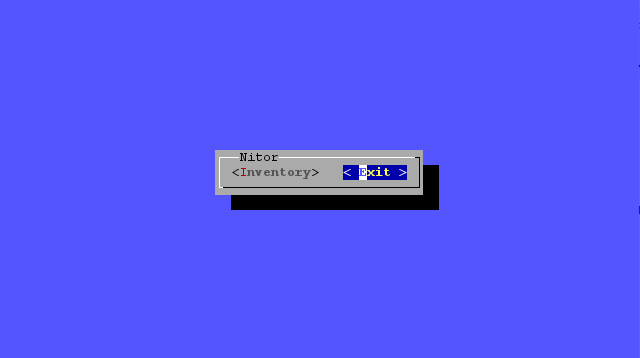
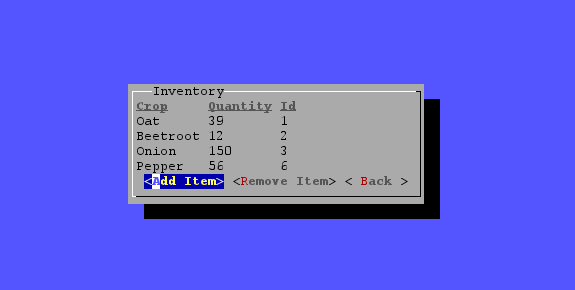
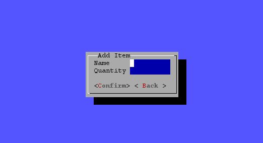
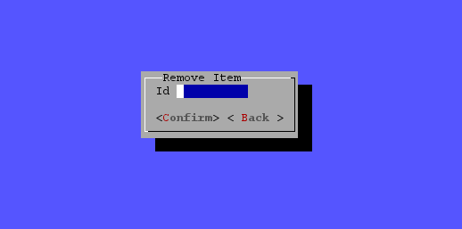

### <u>**Nitor**</u>

User interface for supply management. 

### <u>**Run**</u>

Clone git repo and run fat .jar.

### <u>**Build**</u>

Built using [Lanterna](https://github.com/mabe02/lanterna).  

Dependency management using Maven.

### <u>**Connection**</u>

Connects to local mysql instance at "jdbc:mysql://localhost:3306/nitor".
